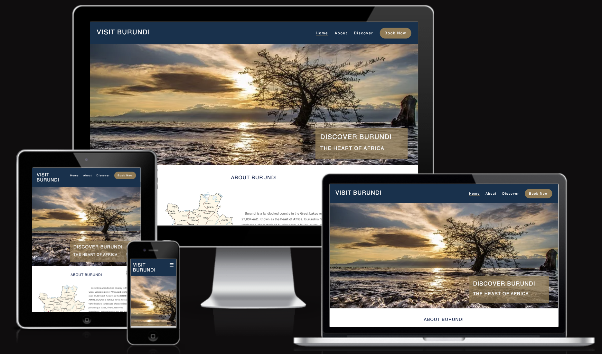
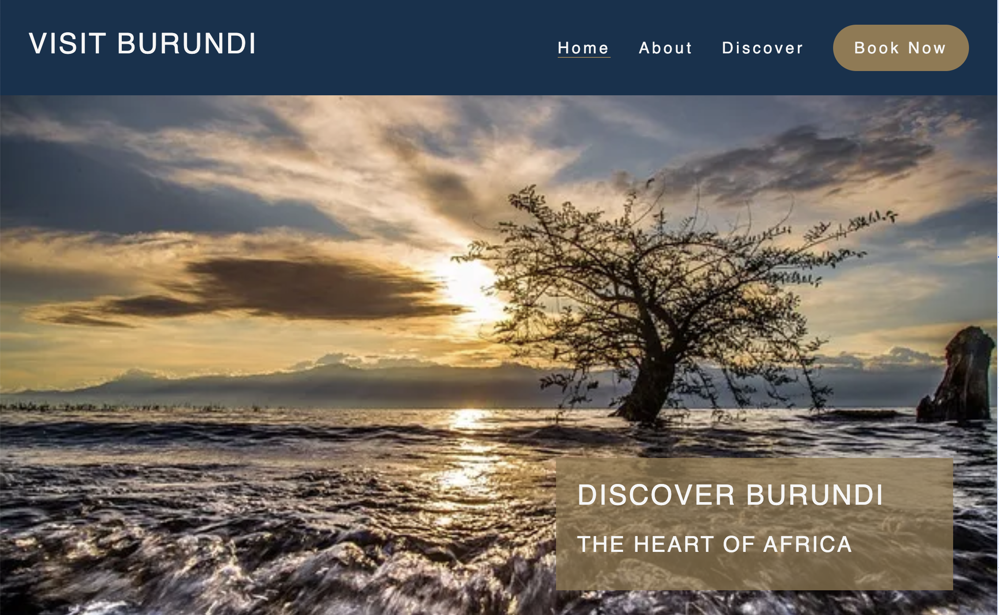
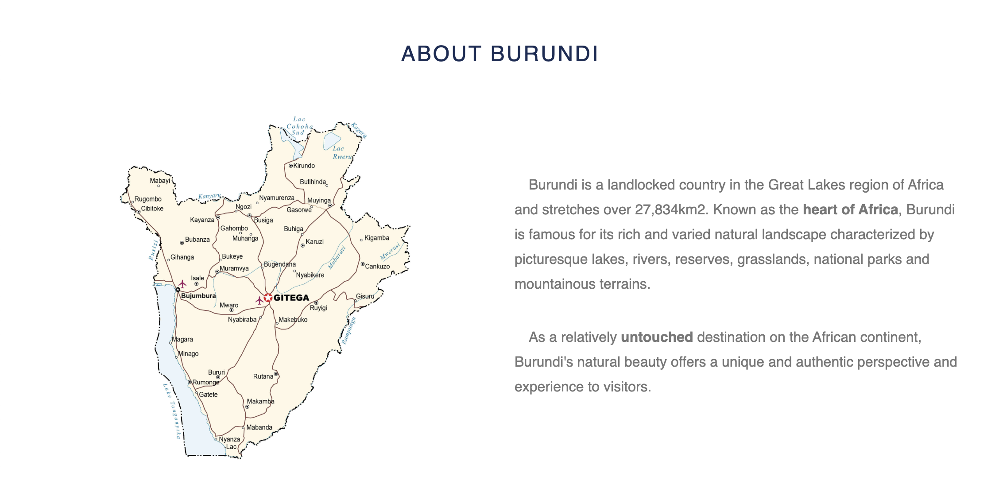
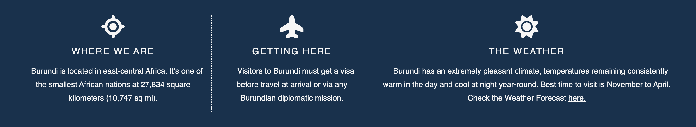
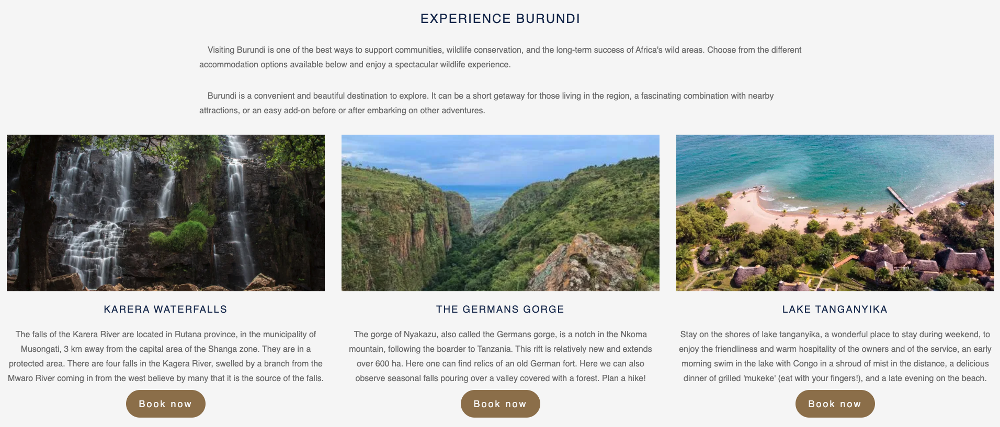
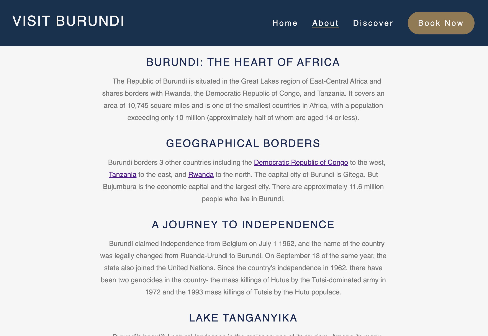
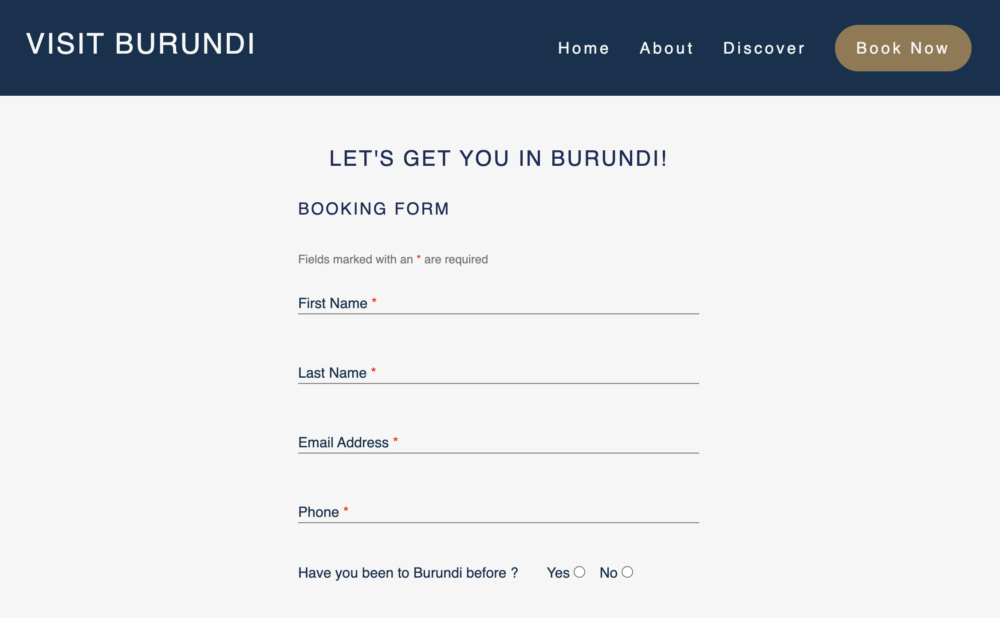
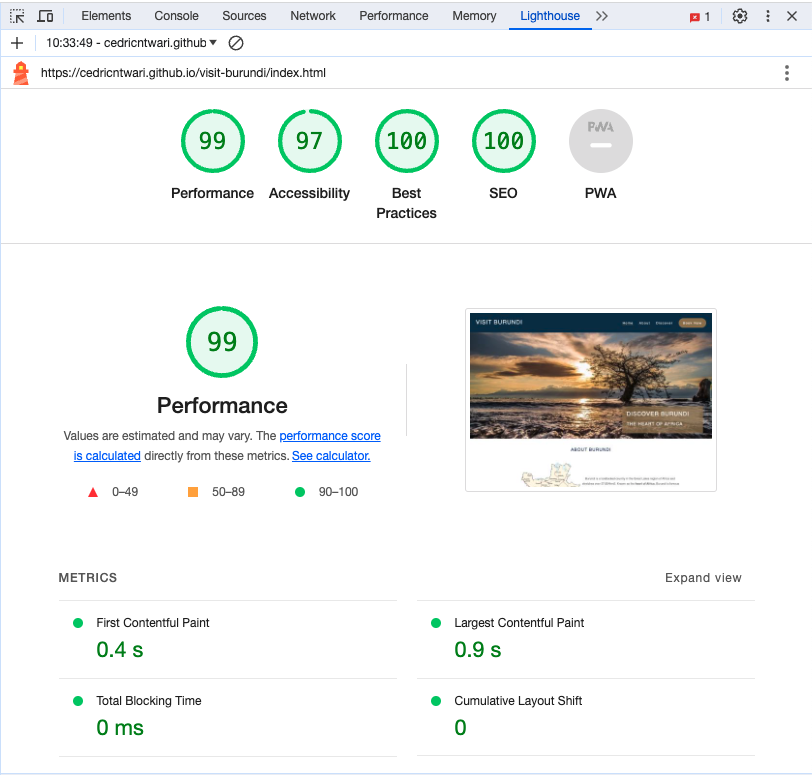

# Visit Burundi

Visit Burundi is a captivating platform that showcases the region's renowned natural beauty, featuring stunning national parks and nature reserves that beckon tourists to explore its breathtaking landscapes.

Users of this website will be able to find all the information they need to plan their trips to Burundi and Explore the wonders of Burundi with us!

## Built with a Mobile-First Approach

Visit Burundi has been designed with a mobile-first approach in mind. This means that the project is initially optimized for mobile devices, ensuring a seamless and engaging experience for visitors on smartphones and tablets. As the project evolves, it will be progressively enhanced to cater to larger screens while retaining its core mobile-friendly design.

## Technologies Used

- HTML
- CSS

## Features

- **Navigation Bar** :
  - A user-friendly navigation bar simplifies exploration, allowing visitors to seamlessly navigate pages of the platform. The nvigation shows the agency name and other navigation links to the right

- **About Section**:
  - An informative and engaging "About Burundi" section.
  - It shows the Burundi map with a nice intro about the country.

- **Facts Section**:
  - Unearth intriguing facts and trivia about Burundi's location, travel, and weather, enriching your understanding of this remarkable region.

- **Experience Burundi Section**:
  - Discover additional facets of Burundi, such as tourist attractions.

- **Footer**:
  - The footer serves as a convenient hub, offering social media links.

- **About Page**:
  - An article of Burundi history and geography borders and more.
  - Plus a Google map of Burundi for users to discover more about the country?s location.

- **Discover Page**:
  - A gallery page with pictures that Offers visual insights.

- **Book now Page**:
  - Where you can book and get in touch with the agency

## Validator Testing

- HTML
  - No errors were returned when passing through the official [W3C validator](https://validator.w3.org/nu/#textarea)
- CSS
  - No errors were found when passing through the official [(Jigsaw) validator](https://jigsaw.w3.org/css-validator/#validate_by_input)
- Accessibility:

  

## Testing

- Tested in different browser : Chrome, Firefox, Safari.
- This website is responsive and functions on all screen sizes using devtools device toolbar.
- All features works good, readable and easy to understand.
- Book now form misses a submit URL.

## Deployment

This project is hosted hosting platform on GitHub.

- The site is deployed to GitHub pages.
- The live link can be found here: <https://cedricntwari.github.io/visit-burundi/>.

## Credits

- I used this website (<https://favicon.io/>) to generate the browser tab icon, for learning purposes.
- I used Google Fonts (<https://fonts.google.com/?query=la>) to get Lazio fonts to style this website.

## Media

- Image sourced from <https://gisgeography.com/> for educational purposes. Usage allowed by the website's terms of use <https://gisgeography.com/how-to-cite/> <https://gisgeography.com/burundi-map/>
- Images from Pikwizard <https://pikwizard.com/s/photo/burundi>, freely available for educational purposes.

## Main Colors Used

- primary-color: #1a2c56
  - Used for: Main brand identity and key elements like headings and links.
- secondary-color: #93794f
  - Used for: Complementary color to the primary color,
    buttons and accents
- tertiary-color: #777
  - Used for: Default text color for paragraphs and body content

## Key topics covered here

- **Building a website**
- **Media Queries**
- **Responsiveness**
- **Site-Specific Content**
- **Manually Testing**
- **Code Layout**
- **Directory Structure**
- **Navigation**
- **Accessibility**

### Suggested Improvements

#### 1. Enhance the "Experience Burundi" Section (Homepage)

**Issue**: The "Experience Burundi" section on the homepage offers a glimpse into the beauty of Burundi. However, to provide users with a more comprehensive experience, it would be beneficial to expand this section to include additional content such as hotels, restaurants, and tourist attractions. Implementing these additions would require the incorporation of JavaScript to dynamically load and display this information.

**Suggested Solution**: Integrate JavaScript to fetch and display data about hotels, restaurants, and popular tourist destinations in Burundi. This would not only enrich the user experience but also offer valuable information to potential visitors.

#### 2. Book now Form: Input Validation (Book Now Page)

**Issue**: Currently, on the Book Now page, the inputs field lacks validation. For example, Adding a pattern validation can enhance user experience and ensure that users provide valid phone numbers.

**Suggested Solution**: Use JavaScript to validate the inputs field.

## Codeanywhere Reminders

To run a frontend (HTML, CSS, Javascript only) application in Codeanywhere, in the terminal, type:

`python3 -m http.server`

A button should appear to click: _Open Preview_ or _Open Browser_.

To run a frontend (HTML, CSS, Javascript only) application in Codeanywhere with no-cache, you can use this alias for `python3 -m http.server`.

`http_server`

To run a backend Python file, type `python3 app.py`, if your Python file is named `app.py` of course.

A button should appear to click: _Open Preview_ or _Open Browser_.

In Codeanywhere you have superuser security privileges by default. Therefore you do not need to use the `sudo` (superuser do) command in the bash terminal in any of the lessons.
